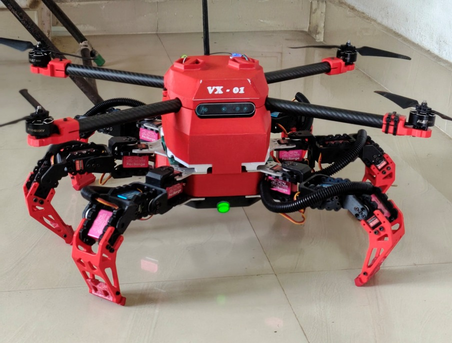

# VX-01 Multi-Terrain Robot


<p align="center">
  
</p>

The **VX-01** is a highly advanced, modular, multi-terrain robotic platform designed for autonomous and manual navigation across land, air, and water. By combining the agility of a hexapod with the flight capabilities of a drone, the VX-01 adapts to virtually any environment.

## 🌟 System Architecture

The core architecture operates on a distributed compute model:
- **High-Level Compute:** **RDK X5** (ARM64) running Ubuntu 22.04 + ROS 2 Humble inside Docker containers. Handles SLAM, inverse kinematics, vision, web dashboard, and high-level mission planning.
- **Flight Controller:** **Pixhawk (ArduPilot)** connected via USB (MAVLink/MAVROS). Manages aerial stabilization, GPS, IMU, and autonomous flight modes.
- **Servo Controller:** **Pololu Maestro Mini**. Receives commands from the RDK X5 via `ros2_control` to actuate the 18 hexapod leg servos.
- **Perception:** **Orbbec Astra** Depth Camera for 3D mapping and obstacle avoidance (RTAB-Map).

## 🚀 Key Features

* **Terrestrial Locomotion:** Hexapod gait generation (Tripod/Wave) with real-time inverse kinematics.
* **Aerial Flight:** Full MAVROS integration for STABILIZE and GUIDED autonomous flight.
* **Web Dashboard:** A sleek, React-based UI communicating via `rosbridge_server` for manual teleop, mapping visualization, and telemetry monitoring.
* **Containerized Deployment:** Entire software stack is split into robust Docker containers (Base, ROS Bridge, MAVROS, Dashboard) managed by `docker-compose`.

## 📦 Workspace Structure

The ROS 2 workspace (`vx01_ws/src`) is heavily modularized:
* `vx01_bringup`: Core launch files and system initialization.
* `vx01_control`: Gait generation, mode management, and locomotion scripts.
* `vx01_description`: URDF, Xacro, and 3D meshes.
* `vx01_hardware`: `ros2_control` hardware interfaces for the Maestro controller.
* `vx01_mapping`: RTAB-Map SLAM integration for the depth camera.
* `vx01_mavros_bridge`: Custom C++ bridging for Pixhawk telemetry and command handling.

## 🛠️ Quick Start

### 1. Build the Docker Images
Use the included cross-compilation and build scripts:
```bash
# Build the base and ROS bridge images
./build.sh build-base

# Build the Web Dashboard
./build.sh build-dashboard
```

### 2. Launch the Hardware Stack
```bash
# Start all background containers (ROS, MAVROS, Dashboard)
docker compose -f docker-compose.rdk.yml up -d

# Drop into the ROS container to launch the hardware
docker exec -it vx01-robot bash
colcon build --symlink-install
ros2 launch vx01_bringup vx01_hw_launch.py
```

### 3. Access the Dashboard
Open a browser and navigate to `http://<robot-ip>:5173` to access the Mission Control Dashboard.

## 🤝 Contributing
Contributions are welcome. Please ensure that all new ROS 2 nodes include proper launch file integration and parameter definitions.
